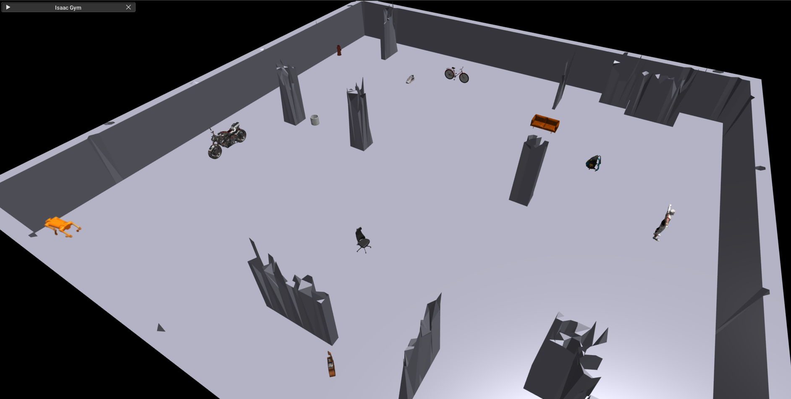

# issacgym_assets

A curated collection of simulation-ready assets (URDFs, meshes, and textures) for NVIDIA Isaac Gym, designed for robotics research, reinforcement learning, and sim-to-real experiments.

<table width="100%">
  <tr>
    <td align="center">
      
    </td>
  </tr>
</table>

## Isaac Gym: Assets & Camera Setup Guide

This guide explains how to:
- Add custom 3D assets into Isaac Gym
- Convert models to usable formats
- Spawn them safely in the environment
- Attach and use cameras for perception

## Available Assets

Below is a list of currently available assets along with their locations in the repository.

### Furniture

- **Office Chair**  
  `resources/objects/office_chair/`

- **Couch**  
  `resources/objects/couch/`

### Everyday Objects

- **Mug**  
  `resources/objects/mug/`

- **Backpack**  
  `resources/objects/bagpack/`

- **Shoes**  
  `resources/objects/shoes/`

- **Fire Hydrant**  
  `resources/objects/fire_hydrant/`

### Vehicles

- **Bicycle**  
  `resources/objects/bicycle/`

- **Motorcycle**  
  `resources/objects/motorcycle/`

### Miscellaneous

- **Guitar**  
  `resources/objects/guitar_new/`

- **Person (Human Model)**  
  `resources/objects/person/`

### 📌 Notes

- Each asset directory typically contains:
  - `.urdf` file (used by Isaac Gym)
  - `.obj` mesh
  - `.mtl` material file
  - `textures/` folder

- All assets are **simulation-ready** and tested with Isaac Gym.

- Naming conventions follow:
  ```bash
  resources/objects/<asset_name>/

## Adding Custom Assets

### 1. Download 3D Models
Download models from:
https://sketchfab.com/3d-models

### 2. Convert `.fbx` → `.obj`

Isaac Gym does **not directly support `.fbx`**, so convert it using any online converter.

### 3. Required File Structure

Your asset folder should look like:

```bash
resources/objects/office_chair/
├── OfficeChair.obj
├── OfficeChair.mtl     # IMPORTANT
├── OfficeChair.urdf
└── textures/
    ├── texture1.png
    └── ...
```

⚠️ Important Notes:

.mtl file is mandatory → links textures to mesh

### 4. Convert .obj → .urdf
Use the [obj2urdf converter](https://github.com/alaflaquiere/obj2urdf) to generate URDF files from OBJ meshes.

```bash
python ~/obj2urdf/obj2urdf.py \
resources/objects/office_chair/OfficeChair.obj
```

### 5. Load Asset in Isaac Gym

```bash
chair_asset_root = "resources/objects/office_chair"
chair_asset_file = "OfficeChair.urdf"

asset_options = gymapi.AssetOptions()
asset_options.fix_base_link = True
asset_options.disable_gravity = True
asset_options.use_mesh_materials = True

self.chair_asset = self.gym.load_asset(
    self.sim,
    chair_asset_root,
    chair_asset_file,
    asset_options
)
```

### 6. Apply Textures

```bash
chair_texture = self.gym.create_texture_from_file(
      self.sim,
      "/resources/objects/office_chair/textures/OfficeChair_OfficeChair_Main_BaseColor.png"
  )

  cx, cy = self.sample_terrain_aware_position(tile, origin_x, origin_y, final_positions, OBJECT_RADII["chair"])
  cz = env_origin[2].item()

  pose = gymapi.Transform()
  pose.p = gymapi.Vec3(cx, cy, cz - 4.0)
  pose.r = gymapi.Quat.from_euler_zyx(1.57, 0, 1.57)

  chair_handle = self.gym.create_actor(
      env_handle, self.chair_asset, pose, "chair", i, 0, 0
  )

  num_chair_bodies = self.gym.get_actor_rigid_body_count(env_handle, chair_handle)

  for b in range(num_chair_bodies):
      self.gym.set_rigid_body_texture(
          env_handle,
          chair_handle,
          b,
          gymapi.MESH_VISUAL,
          chair_texture
      )
```

### Smart Object Placement (Terrain-Aware)

To avoid floating or colliding objects, use terrain-aware sampling:

```bash
def sample_terrain_aware_position(self, tile, origin_x, origin_y, existing_positions, radius):
```

## Camera Setup in Isaac Gym

### Create Camera

```bash
camera_props = gymapi.CameraProperties()
camera_props.width = 640
camera_props.height = 480
camera_props.horizontal_fov = 60.0
camera_props.enable_tensors = False  # CPU pipeline
```

### Attach Camera to Robot

```bash
self.gym.attach_camera_to_body(
    camera_handle,
    env_handle,
    anymal_handle,
    gymapi.Transform(
        gymapi.Vec3(0.3, 0.0, 0.2),
        gymapi.Quat.from_euler_zyx(0, 0, 0)
    ),
    gymapi.FOLLOW_TRANSFORM
)
```

### Camera Intrinsics

```bash
fx = W / (2 * np.tan(fov / 2))
fy = fx
cx = W / 2
cy = H / 2
```

### Capture RGB + Depth

```bash
rgb = self.gym.get_camera_image(self.sim, env, cam, gymapi.IMAGE_COLOR)
depth = self.gym.get_camera_image(self.sim, env, cam, gymapi.IMAGE_DEPTH)

rgb = rgb.reshape((H, W, 4))[:, :, :3]
depth = np.abs(depth.reshape((H, W)))
```


